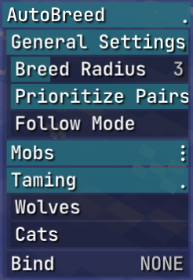
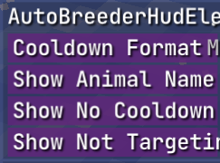

    

<h1 align="center">GarlicBreeder</h1>

**A RusherHacks Plugin - Automatically breeds animals and displays breeding cooldowns in the HUD**

  
  
  

## **📌 Features**

### 🐾 **AutoBreed Module**

- **Automatic Animal Breeding** – Detects and breeds nearby animals automatically.
- **Supports Multiple Mobs** – Works with cows, sheep, pigs, chickens, foxes, pandas, turtles, bees, frogs, goats, hoglins, striders, mooshrooms, rabbits, sniffers and camels.
- **Breeding Pair Prioritization** – Ensures pairs are bred optimally.
- **Follow Mode** – Makes animals follow you without breeding.
- **Baby Feeding Mode** – Instantly grows baby animals by continuously feeding them.
- **Taming Support** – Automatically tames wolves and cats.

### 🕒 **Breeding Cooldown HUD**

- **Live Cooldown Display** – Shows how much time remains before an animal can breed again.
- **Customizable Display Options** – Choose whether to display the animal's name, cooldown format, and no-cooldown messages.
- **Time Format Selection** – Convert the cooldown display between **seconds**, **minutes**, or **both**.
- **Lightweight & Optimized** – Works seamlessly with RusherHacks without impacting performance.

## **⚙️ Module & HUD Settings**

    
    

### **Available Settings**

| Setting                    | Description                                              |
| -------------------------- | -------------------------------------------------------- |
| **Breed Radius**           | The maximum range to search for animals to breed         |
| **Prioritize Pairs**       | Ensures pairs are bred optimally                         |
| **Follow Mode**            | Makes animals follow you without breeding                |
| **Feed Babies**            | Feeds baby animals continuously to speed up their growth |
| **Tame Wolves**            | Automatically tame wolves                                |
| **Tame Cats**              | Automatically tame cats                                  |
| **Show Cooldown Timer**    | Toggle displaying the cooldown for breeding animals      |
| **Cooldown Format**        | Display time in **seconds**, **minutes**, or **both**    |
| **Show Animal Name**       | Toggle animal name in the cooldown display               |
| **Show No Cooldown Msg**   | Display a message when an animal is **ready to breed**   |
| **Show Not Targeting Msg** | Show a message when you're not aiming at a breedable mob |

## **🔧 Installation**

1. Download the latest release from the **[Releases](https://github.com/GarlicRot/GarlicBreeder/releases)** page.
2. Place the `.jar` file in your `rusherhacks/plugins` folder.
3. Launch Minecraft with **RusherHacks** installed.
4. Enable the **AutoBreed Module** and/or **AutoBreeder HUD Element**

## 📜 Changelog

Stay updated with all changes and improvements by checking the [CHANGELOG.md](CHANGELOG.md) file. Each release documents the added features, bug fixes, and other updates to the plugin.

## 🐛 Reporting Issues

If you encounter bugs or have feature requests, please use the appropriate [issue templates](https://github.com/GarlicRot/GarlicBreeder/issues/new/choose) provided in the repository:

- [Bug Report](https://github.com/GarlicRot/GarlicBreeder/issues/new?template=bug_report.md)  
- [Feature Request](https://github.com/GarlicRot/GarlicBreeder/issues/new?template=feature_request.md)

For custom issues or general inquiries, use the [Custom Issue](https://github.com/GarlicRot/GarlicBreeder/issues/new?template=custom_issue.md) template.

## **🤝 Contributing**

Contributions are welcome! Please check out the [CONTRIBUTING.md](CONTRIBUTING.md) file for guidelines on how to contribute to this project.
